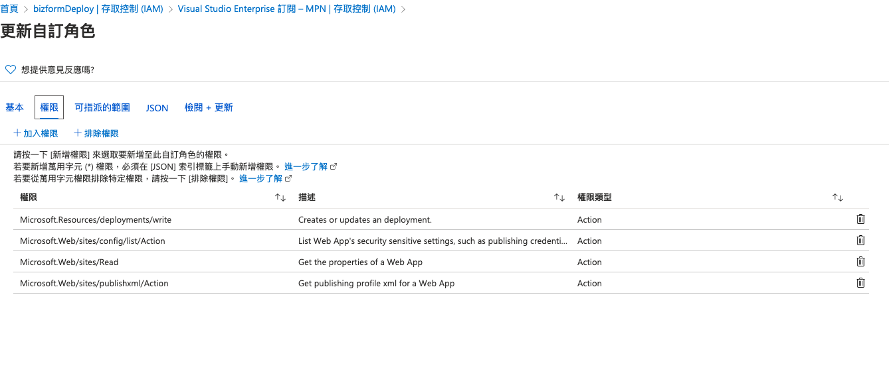

# web app

## 部屬到 Azure

* 在 Azure AD 應用程式註冊加入一個服務
* 取得該 `識別碼` \($username\)
* 憑證及祕密建立密碼 \($password\)
* 在要部署的應用程式中 `存取控制權 (IAM)` 給予剛建立應用程式 `參與者` 或 `自訂角色`
* 在 CI 的加上環境變數
  * username \(應用程式識別碼\)
  * password \(應用程式密碼\)
  * tenant \(租戶 ID\)
  * subscription \(訂閱 ID\)
  * rg \(資源群組\)
  * serviceName \(應用服務名稱\)
* [sample](https://gitlab.com/weitingTW/azure-deploy/)

### 最小權限原則

使用 [az role 自訂義角色](https://docs.microsoft.com/zh-tw/azure/role-based-access-control/custom-roles-cli)

#### 建立自訂角色

> az role definition create --role-definition {roleDefinition}

deployer.json

```javascript
{
  "Name": "App Service Deployer",
  "Actions": [
    "Microsoft.Resources/deployments/write",
    "Microsoft.Web/sites/config/list/action",
    "Microsoft.Web/sites/read",
    "Microsoft.Web/sites/publishxml/action",
    "Microsoft.Web/sites/basicPublishingCredentialsPolicies/read"
  ],
  "AssignableScopes": [
    "/subscriptions/{subscriptionId}",
    "/subscriptions/{subscriptionId}/resourceGroups/{groupName}"
  ]
}
```

> az role definition create --role-definition deployer.json

#### 如果需要用預備環境切換的話 Actions 需增加下列權限

* Microsoft.Web/sites/slots/config/list/action
* Microsoft.Web/sites/slots/read
* Microsoft.Web/sites/slots/publishxml/action
* Microsoft.Web/sites/slots/basicPublishingCredentialsPolicies/read

#### 手動切換 router

可以使用 `x-ms-routing-name` 查詢參數

```markup
<a href="<webappname>.azurewebsites.net/?x-ms-routing-name=self">production</a>
<a href="<webappname>.azurewebsites.net/?x-ms-routing-name=staging">staging</a>
```

依預設，新的位置會取得的路由規則 0% ，以`灰色顯示`。當您`明確地將此值設定為 0%` 顯示在`黑色文字`\) \(時，您的使用者可以使用查詢參數手動存取預備位置 `x-ms-routing-name` 。但是，它們不會自動路由到位置，因為路由百分比設定為 0。這是一種先進的案例，可讓您從公用「隱藏」預備位置，同時讓內部團隊可以測試位置的變更。

#### 其他指令

更新自訂角色

> az role definition update --role-definition {roleDefinition}

取得自訂角色定義

> az role definition list --name {roleNameOrId}

刪除自訂角色

> az role definition delete --name {roleNameOrId}

#### 使用 portal 設定

在訂用帳戶/資源群組的存取控制\(IAM\) 新增自訂建立角色



設定權限清單


可指派範圍可以設定在訂閱或資源群組上


## 使用 Docker 時，無法連線到站台時

預設會使用容器的 `80` 或 `8080` 的 port

當 port 不是上述時，可以透過在 APPLICATION SETTINGS 設定環境變數 `WEBSITES_PORT` 來解決

<https://docs.microsoft.com/zh-tw/azure/app-service/configure-custom-container?pivots=container-linux#configure-port-number>

## WebP 出現 404 的問題

```web.config
<configuration>
    <system.webServer>
        <staticContent>
            <mimeMap fileExtension="webp" mimeType="image/webp" />
        </staticContent>
    </system.webServer>
</configuration>
```

## React Route 問題

```web.config
<configuration>
    <system.webServer>
        <rewrite>
            <rules>
                <rule name="React Routes" stopProcessing="true">
                    <match url=".*" />
                    <conditions logicalGrouping="MatchAll">
                        <add input="{REQUEST_FILENAME}" matchType="IsFile" negate="true" />
                        <add input="{REQUEST_FILENAME}" matchType="IsDirectory" negate="true" />
                    </conditions>
                    <action type="Rewrite" url="/index.html" />
                </rule>
            </rules>
        </rewrite>
    </system.webServer>
</configuration>
```