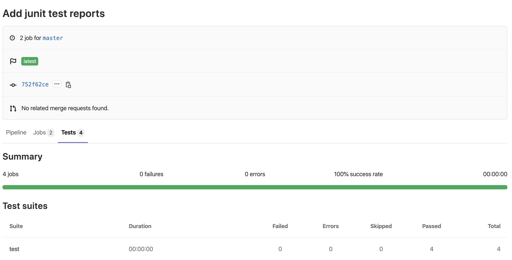

# GitLab-CI

## yml example

### .Net Core

```text
image: mcr.microsoft.com/dotnet/core/sdk:3.1

stages:
  - test

test:
  stage: test
  script:
    - dotnet build
    - dotnet test --no-restore --no-build --logger:"junit;LogFilePath=bin/TestResults.xml" /p:CollectCoverage=true /p:CoverletOutputFormat=opencover /p:CoverletOutput=./coverage
    - dotnet tool install dotnet-reportgenerator-globaltool --tool-path tools
    - ./tools/reportgenerator -reports:"**/coverage.opencover.xml" -targetdir:"coverage"
  artifacts:
    paths:
      - ./coverage
    reports:
      junit:
        - '*/*/TestResults.xml'
```

### JavaScript

```text
image: node:8

stages:
  - test
  - deploy

before_script:
  - npm install

test:
  script:
  - npm test
  artifacts:
    paths:
      - coverage/
    reports:
      junit:
        - '*/test-results.xml'

cache:
  paths:
    - node_modules/

#deploy to gitlab page
pages:
  stage: deploy
  dependencies:
    - test
  script:
    - mv coverage/lcov-report/ public/
  artifacts:
    paths:
      - public
    expire_in: 30 days
  only:
    - master
```

```text
image: node:8

stages:
  - build
  - deploy

.before_script_template: &build-init
  script:
    - npm config set '//npm.fontawesome.com/:_authToken' "${FONTAWESOME_TOKEN}"
    - npm install
    - git submodule init
    - git submodule update
    - npm run plugin

# using ssh to get submodule
before_script:
  - 'which ssh-agent || ( apt-get update -y && apt-get install openssh-client -y )'
  - eval $(ssh-agent -s)
  - echo "$SSH_PRIVATE_KEY" | tr -d '\r' | ssh-add - > /dev/null
  - mkdir -p ~/.ssh
  - chmod 700 ~/.ssh
  - ssh-keyscan "$SSH_KNOWN_HOSTS" > ~/.ssh/known_hosts
  - echo "$SERVER_IP $SERVER" >> /etc/hosts
  - ssh-keyscan "$SERVER" >> ~/.ssh/known_hosts
  - chmod 644 ~/.ssh/known_hosts

build-dev:
  stage: build
  <<: *build-init
  after_script:
    - npm run build
  artifacts:
    name: dev
    paths:
      - dist/

build-prod:
  stage: build
  <<: *build-init
  after_script:
    - npm run build:prod
  artifacts:
    name: prod
    paths:
      - dist/
  only:
    - master

deploy:
  stage: deploy
  script:
    - scp -rv dist/* $USER@$SERVER:$PATH
  dependencies: [build-dev]
  allow_failure: true
  only:
    - master

cache:
  paths:
    - node_modules/
```

### [JUnit test reports](https://docs.gitlab.com/ee/ci/junit_test_reports.html)

#### Use cases

Consider the following workflow:

* Your master branch is rock solid, your project is using GitLab CI/CD and your pipelines indicate that there isn’t anything broken.
* Someone from your team submits a merge request, a test fails and the pipeline gets the known red icon. To investigate more, you have to go through the job logs to figure out the cause of the failed test, - which usually contain thousands of lines.
* You configure the JUnit test reports and immediately GitLab collects and exposes them in the merge request. No more searching in the job logs.
* Your development and debugging workflow becomes easier, faster and efficient.

#### .Net Core

```text
## Source code and documentation are here: https://github.com/spekt/junit.testlogger/

Test:
  stage: test
  script:
    - 'dotnet test --test-adapter-path:. --logger:"junit;LogFilePath=..\artifacts\{assembly}-test-result.xml;MethodFormat=Class;FailureBodyFormat=Verbose"'
  artifacts:
    when: always
    paths:
      - ./**/*test-result.xml
    reports:
      junit:
       - ./**/*test-result.xml
```

#### JavaScript with Mocha

[JUnit Reporter for Mocha](https://www.npmjs.com/package/mocha-junit-reporter)

Produces JUnit-style XML test results.

```text
test:
  script:
  - npx mocha test--reporter mocha-junit-reporter
  artifacts:
    paths:
      - '*/test-results.xml'
    reports:
      junit:
        - '*/test-results.xml'
```

### View

If JUnit XML files are generated and uploaded as part of a pipeline, these reports can be viewed inside the pipelines details page. The Tests tab on this page will display a list of test suites and cases reported from the XML file.



## [MinIO](https://min.io/)

MinIO is High Performance Object Storage released under Apache License v2.0. It is API compatible with Amazon S3 cloud storage service. Using MinIO build high performance infrastructure for machine learning, analytics and application data workloads.

### [Install with docker](https://docs.min.io/docs/minio-docker-quickstart-guide.html)

```bash
docker run -it --restart always -p 9005:9000 \
    --name minio \
    -e "MINIO_ACCESS_KEY=YOUR_ACCESS_KEY" \
    -e "MINIO_SECRET_KEY=YOUR_SECRET_KEY" \
    -v /.minio:/root/.minio -v /export:/export \
    minio/minio:latest server /export
```

### [Set gitlab-runner config](https://docs.gitlab.com/runner/configuration/autoscale.html#distributed-runners-caching)

```text
[[runners]]
  limit = 10
  executor = "docker+machine"
  [runners.cache]
    Type = "s3"
    Path = "path/to/prefix"
    Shared = false
    [runners.cache.s3]
      ServerAddress = "MinIO_server_url"
      AccessKey = "YOUR_ACCESS_KEY"
      SecretKey = "YOUR_SECRET_KEY"
      BucketName = "runner"
      Insecure = false # using https
```

