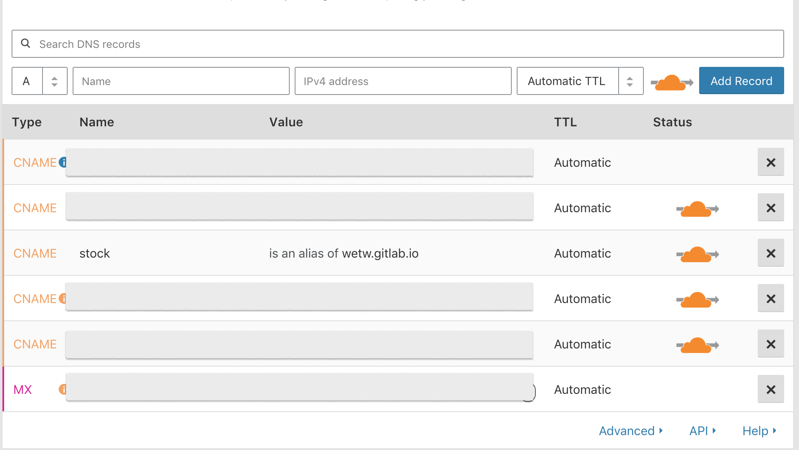

# GitLab

## 自訂網域 with cloudflare

### STEP 1. Add DNS Record (CNAME)



### STEP 2. Generate your certificate

#### Copy the PEM certificate and the private key from cloudflare

> 設定 > 頁面 > + New Domain

#### Enabled

- [x] Force domains with SSL certificates to use HTTPS


### STEP 3. Copy CloudFlare's Origin CA — RSA Root

CloudFlare doesn't combine both PEM and root certificates in one.

```txt
-----BEGIN CERTIFICATE-----
MIID/DCCAuagAwIBAgIID+rOSdTGfGcwCwYJKoZIhvcNAQELMIGLMQswCQYDVQQG
EwJVUzEZMBcGA1UEChMQQ2xvdWRGbGFyZSwgSW5jLjE0MDIGA1UECxMrQ2xvdWRG
bGFyZSBPcmlnaW4gU1NMIENlcnRpZmljYXRlIEF1dGhvcml0eTEWMBQGA1UEBxMN
U2FuIEZyYW5jaXNjbzETMBEGA1UECBMKQ2FsaWZvcm5pYTAeFw0xNDExMTMyMDM4
NTBaFw0xOTExMTQwMTQzNTBaMIGLMQswCQYDVQQGEwJVUzEZMBcGA1UEChMQQ2xv
dWRGbGFyZSwgSW5jLjE0MDIGA1UECxMrQ2xvdWRGbGFyZSBPcmlnaW4gU1NMIENl
cnRpZmljYXRlIEF1dGhvcml0eTEWMBQGA1UEBxMNU2FuIEZyYW5jaXNjbzETMBEG
A1UECBMKQ2FsaWZvcm5pYTCCASIwDQYJKoZIhvcNAQEBBQADggEPADCCAQoCggEB
AMBIlWf1KEKR5hbB75OYrAcUXobpD/AxvSYRXr91mbRu+lqE7YbyyRUShQh15lem
ef+umeEtPZoLFLhcLyczJxOhI+siLGDQm/a/UDkWvAXYa5DZ+pHU5ct5nZ8pGzqJ
p8G1Hy5RMVYDXZT9F6EaHjMG0OOffH6Ih25TtgfyyrjXycwDH0u6GXt+G/rywcqz
/9W4Aki3XNQMUHNQAtBLEEIYHMkyTYJxuL2tXO6ID5cCsoWw8meHufTeZW2DyUpl
yP3AHt4149RQSyWZMJ6AyntL9d8Xhfpxd9rJkh9Kge2iV9rQTFuE1rRT5s7OSJcK
xUsklgHcGHYMcNfNMilNHb8CAwEAAaNmMGQwDgYDVR0PAQH/BAQDAgAGMBIGA1Ud
EwEB/wQIMAYBAf8CAQIwHQYDVR0OBBYEFCToU1ddfDRAh6nrlNu64RZ4/CmkMB8G
A1UdIwQYMBaAFCToU1ddfDRAh6nrlNu64RZ4/CmkMAsGCSqGSIb3DQEBCwOCAQEA
cQDBVAoRrhhsGegsSFsv1w8v27zzHKaJNv6ffLGIRvXK8VKKK0gKXh2zQtN9SnaD
gYNe7Pr4C3I8ooYKRJJWLsmEHdGdnYYmj0OJfGrfQf6MLIc/11bQhLepZTxdhFYh
QGgDl6gRmb8aDwk7Q92BPvek5nMzaWlP82ixavvYI+okoSY8pwdcVKobx6rWzMWz
ZEC9M6H3F0dDYE23XcCFIdgNSAmmGyXPBstOe0aAJXwJTxOEPn36VWr0PKIQJy5Y
4o1wpMpqCOIwWc8J9REV/REzN6Z1LXImdUgXIXOwrz56gKUJzPejtBQyIGj0mveX
Fu6q54beR89jDc+oABmOgg==
-----END CERTIFICATE-----
```

like:


- ref: <https://gitlab.com/help/user/project/pages/getting_started_part_three.md#dns-txt-record>

### STEP 4. Set DNS Record (TXT) for verification


### STEP 5. Finally


## 使用 Gitlab Pages

在使用Pages時，baseUrl需要設定為projectName，才可正確載入js檔案

```js
module.exports = {
  baseUrl: process.env.NODE_ENV === 'production'
    ? '/yourProjectName/'
    : '/'
}
```

gitlab 的 CI/CD 配置管理

<http://blog.51cto.com/flyfish225/2156602>