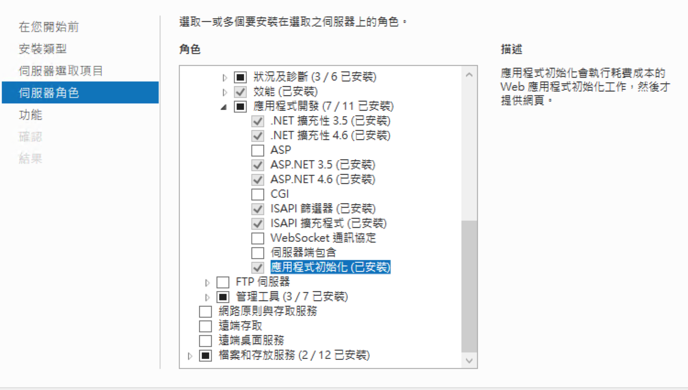
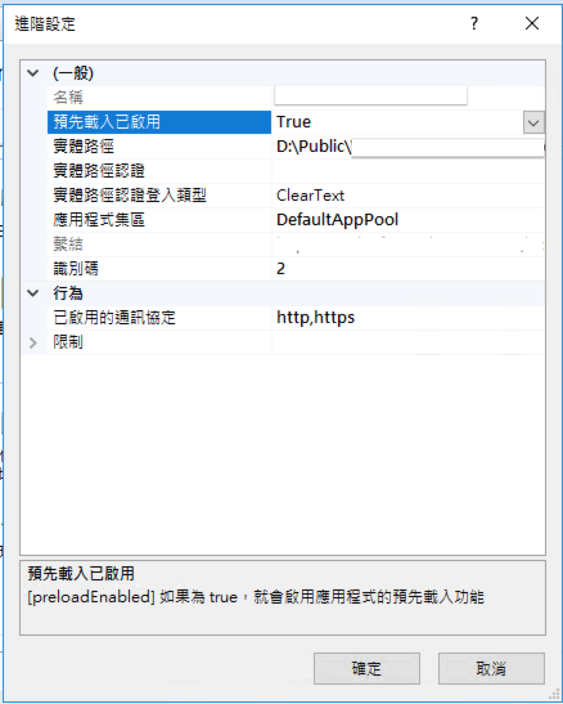
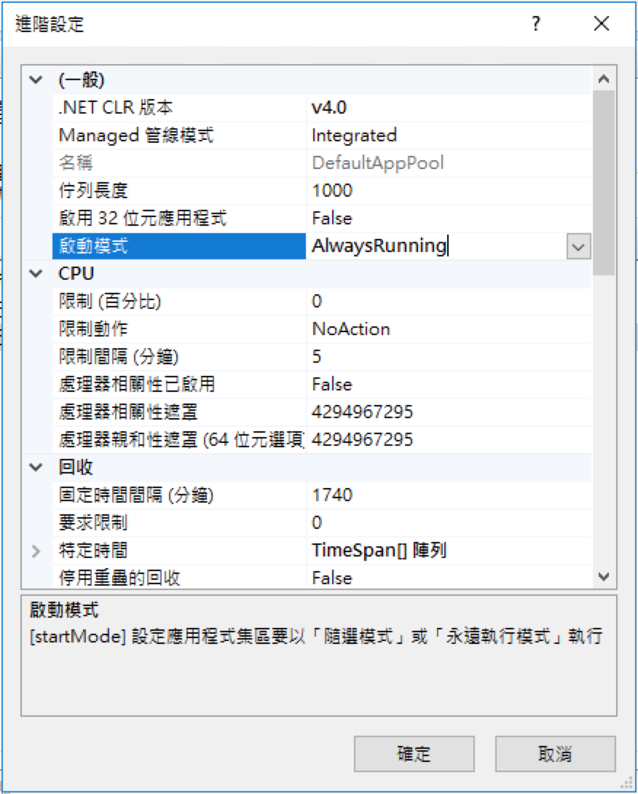

# IIS

## IIS Crypto Tool

IIS Crypto is a free tool that gives administrators the ability to enable or disable protocols, ciphers, hashes and key exchange algorithms on Windows Server 2008, 2012, 2016 and 2019. It also lets you reorder SSL/TLS cipher suites offered by IIS, change advanced settings, implement Best Practices with a single click, create custom templates and test your website.

[Download](https://www.nartac.com/Products/IISCrypto/Download)

## 讓 IIS 網站保持運作狀態

1. 安裝「應用程式初始化\(Application Initialization\)」

    

2. 網站的進階設定「預先載入已啟用」設為 True

    

3. 應用程式集區的進階設定「啟動模式」設為 True

    

## 讓 IIS Express 外部存取

1. 使用 netsh 以本機 IP 及 站台 port 加入 URL 保留區\( access control list\)

   ```bash
    netsh http add urlacl url=http://10.211.55.3:49486/ user=everyone
   ```

   刪除

   ```bash
    netsh http delete urlacl url=http://10.211.55.3:49486
   ```

2. 修改專案底下 `.vs/config`

   Edit bindingInformation `<ip-address>:<port>:<host-name>`

   ```diff
        <site name="GSS.Duck.WebApi" id="2">
            <application path="/" applicationPool="Clr4IntegratedAppPool">
                <virtualDirectory path="/" physicalPath="Z:\Workspace\BizForm\duck\src\GSS.Duck.WebApi" />
            </application>
            <bindings>
                <binding protocol="http" bindingInformation="*:49486:localhost" />
    +           <binding protocol="http" bindingInformation="*:49486:10.211.55.4" />
            </bindings>
        </site>
   ```

3. 開啟防火牆

   ```bash
    netsh advfirewall firewall add rule name="Demo IIS Express" protocol=TCP dir=in localport=49486 action=allow
   ```

## 403. Forbidden

Folder permissions for web application

Folder add permission  
User Name: `IIS AppPool\ApplicationPoolName`

## 透過 URL Rewrite 來實作 cookie 重導

```web.config
<rewrite>
    <rules>
        <!-- Rule to conditionally remove "backend" based on a cookie -->
        <rule name="Conditional Remove Backend from URL" stopProcessing="true">
            <match url="^backend/(.*)" ignoreCase="true" />
            <conditions>
                <add input="{HTTP_COOKIE}" pattern="x-ms-routing-name=self" />
            </conditions>
            <action type="Rewrite" url="staging/{R:1}" />
        </rule>

        <!-- Rules for cookie-based routing to staging and preview -->
        <rule name="Route to Staging" stopProcessing="true">
            <match url="^backend/(.*)" />
            <conditions>
                <add input="{HTTP_COOKIE}" pattern="x-ms-routing-name=staging" />
            </conditions>
            <action type="Rewrite" url="staging/{R:1}" />
        </rule>

        <rule name="Route to Preview" stopProcessing="true">
            <match url="^backend/(.*)" />
            <conditions>
                <add input="{HTTP_COOKIE}" pattern="x-ms-routing-name=preview" />
            </conditions>
            <action type="Rewrite" url="preview/{R:1}" />
        </rule>

        <rule name="Route to Production" stopProcessing="true">
            <match url="^backend/(.*)" />
            <conditions>
                <add input="{HTTP_COOKIE}" pattern="x-ms-routing-name=production" />
            </conditions>
            <action type="Rewrite" url="production/{R:1}" />
        </rule>
    </rules>
</rewrite>
```