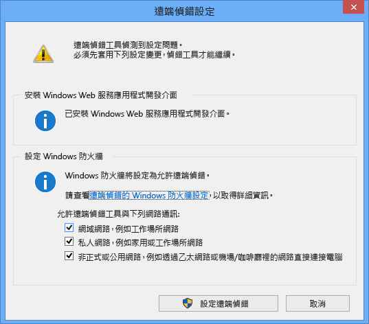
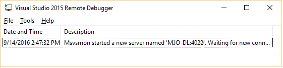

# 遠端偵錯-Remote Debugger

## with IIS

1. 下載 Visual Studio 2017 遠端工具

   [x64](https://aka.ms/vs/15/release/RemoteTools.amd64ret.cht.exe) [x86](https://aka.ms/vs/15/release/RemoteTools.x86ret.cht.exe) [other](https://visualstudio.microsoft.com/zh-hant/downloads/)

2. 在 windows 上安裝/設定遠端偵錯 **需要系統管理權限** 

   設定完後  **預設使用port: 4022**

3. 從vs2017連到IIS進行偵錯

   pending

## with Azure

